name: south-african-total-auditing-and-due-diligence-2026
version: 2.0.0
type: agent-skill
description: "The complete, non-exhaustive statutory auditing, forensic due diligence, governance, and assurance execution architecture for Registered Auditors (RAs) and Chartered Accountants [CA(SA)] in South Africa as of 2026. Codified via canonical Semantic Anchors, international standards (IAASB, IESBA, ISSB), South African statutory legislation (Companies Act, APA, FICA, POPIA, PFMA, MFMA, PRECCA, Tax Administration Act), and corporate governance frameworks (King IV, JSE Listings Requirements, SARB Exchange Control)."
author: "LLM Coding & Auditing Standards Architecture Working Group"
anchors_inventory:
  - "Companies Act 71/2008 & 2024 Amendments (SA Parliament)"
  - "JSE Listings Requirements & IFRS S1/S2 Directives (JSE / FSCA)"
  - "SARB Financial Surveillance Directives (SARB / FinSurv)"
  - "FICA Act 38/2001 & GLAA 2022/2026 (FIC / SA Parliament)"
  - "National Payment System Act & FSRA Twin Peaks (SARB / PA / FSCA)"
  - "ISQM 1 & ISQM 2 (IAASB)"
  - "IRBA Code of Professional Conduct & SAICA By-Laws (IRBA / SAICA)"
  - "Companies Act Sec 90-93 (SA Parliament)"
  - "ISA 210 (IAASB)"
  - "PRECCA Act 12/2004 (SA Parliament)"
  - "ISA 300 & King IV Combined Assurance (IAASB / IoDSA)"
  - "ISA 315 Revised (IAASB)"
  - "ITGC, COBIT 2019 & ISO/IEC 27001 (ISACA / ISO)"
  - "POPIA Act 4/2013 & Cybercrimes Act 19/2020 (Information Regulator / SA Parliament)"
  - "COSO Internal Control 2013 Framework (COSO / Treadway Commission)"
  - "ISA 320 & ISA 450 (IAASB)"
  - "ISA 240 & Benford's Law (IAASB / Frank Benford / Mark Nigrini)"
  - "ISA 600 Revised (IAASB)"
  - "Labour Relations Act 66/1995 & BCEA 75/1997 (SA Parliament / CCMA)"
  - "ISA 330 (IAASB)"
  - "ISA 500, 501, 505 (IAASB)"
  - "ISA 520 Substantive Analytics (IAASB)"
  - "ISA 530 & Monetary Unit Sampling (IAASB / Guy, Carmichael, Whittington)"
  - "ISA 540 Revised (IAASB / IFRS Foundation)"
  - "ISA 550 & Companies Act Sec 45/75 (IAASB / SA Parliament)"
  - "Tax Administration Act 28/2011 & Income Tax Act 58/1962 (SARS / SA Parliament)"
  - "ISSA 5000, ISAE 3410 & IFRS S1/S2 (IAASB / ISSB)"
  - "B-BBEE Codes of Good Practice (B-BBEE Commission / dtic)"
  - "Section 45 Reportable Irregularities (Auditing Profession Act 26/2005 / IRBA)"
  - "Section 4 Solvency & Liquidity Test (Companies Act 71/2008 / SA Parliament)"
  - "PFMA Act 1/1999 & MFMA Act 56/2003 (National Treasury / AGSA)"
  - "Competition Act 89/1998 & Amendment Act 18/2018 (Competition Commission SA)"
  - "National Environmental Management Act - NEMA 107/1998 (DFFE / SA Parliament)"
  - "ISA 560 Subsequent Events (IAASB)"
  - "ISA 570 Revised Going Concern (IAASB / SA Parliament)"
  - "ISA 580 Written Representations (IAASB)"
  - "ISA 260 & ISA 265 TCWG Reporting (IAASB / King IV)"
  - "ISA 220 Revised & ISQM 2 EQCR (IAASB)"
  - "ISA 700 Revised, 701, 705, 706 (IAASB)"
  - "CIPC iXBRL & Annual Return Filings (CIPC / SA Parliament)"

## 1. Skill Master Blueprint & Due Diligence Mandate

This skill establishes the definitive operational execution standard for performing statutory financial statement audits, forensic due diligence, corporate governance audits, and regulatory assurance in South Africa as of 2026. Every check, balance, substantive test, and compliance verification is mapped directly to authoritative literature, international standards, and South African statutory acts, structured as an interconnected non-linear system.

## 2. Complete Nonlinear Backreferencing Architecture Graph

```mermaid
flowchart TD
    %% =========================================================================
    %% TOTAL SOUTH AFRICAN AUDITING & DUE DILIGENCE KNOWLEDGE GRAPH (2026)
    %% Deep Structural & Non-Linear Back-Referencing Architecture
    %% =========================================================================

    subgraph PHASE_0_GENESIS ["Phase 0: Entity Genesis, Structure, PI Score & Jurisdiction Scoping"]
        A01["Companies Act 71/2008 Reg 26-28 & 2024 Amendments<br/><i>(SA Parliament)</i><br/>Public Interest (PI) Score Calculation & Audit vs Independent Review Mandate"]
        A02["JSE Listings Requirements & Debt/Equity Directives<br/><i>(JSE / FSCA, 2024-2026)</i><br/>Accreditation, IFRS S1/S2 Compliance & Primary/Secondary Listing Scoping"]
        A03["SARB Financial Surveillance & Exchange Control Directives<br/><i>(South African Reserve Bank / FinSurv)</i><br/>Cross-Border Loop Structures, Capital Outflows & Authorized Dealer Approvals"]
        A04["FICA Schedule 1 (Accountable Institutions) & GLAA 2022/2026<br/><i>(FIC / SA Parliament)</i><br/>Ultimate Beneficial Ownership (UBO), Targeted Financial Sanctions (TFS) & PEP Matrix"]
        A05["National Payment System Act 78/1998 & FSRA 9/2017 Twin Peaks<br/><i>(SARB / PA / FSCA)</i><br/>Financial Sector Prudential Standards & Crypto Asset Service Provider (CASP) Scoping"]
    end

    subgraph PHASE_1_PRE_ENGAGEMENT ["Phase 1: Pre-Engagement, Ethics, Quality & Forensic Vetting"]
        B01["ISQM 1 & ISQM 2 Frameworks<br/><i>(IAASB, 2022-2025)</i><br/>Firm-Wide Risk Assessment, Remediation Monitoring & EQCR Assignment"]
        B02["IRBA Code of Conduct & SAICA By-Laws (2024/2026 Edition)<br/><i>(IRBA / SAICA / IESBA)</i><br/>Independence, Long Association, Fee Dependency (>15% cap) & NOCLAR Protocols"]
        B03["Companies Act Sec 90-93 & JSE Mandatory Rotation Guidance<br/><i>(SA Parliament / IRBA / JSE)</i><br/>Statutory Auditor Disqualification & Designated Partner 5-Year Cooling-Off"]
        B04["ISA 210 & Engagement Terms Structuring<br/><i>(IAASB)</i><br/>Scope Definition, Preconditions Verification & Tripartite Governance Engagement"]
        B05["Forensic Integrity Screening & PRECCA Act 12/2004<br/><i>(SA Parliament)</i><br/>Bribery, Gratification, Whistleblower & Corruption Background Checks"]
    end

    subgraph PHASE_2_PLANNING_RISK ["Phase 2: Strategy, Risk Assessment & Combined Assurance"]
        C01["ISA 300 & Combined Assurance Architecture<br/><i>(IAASB / King IV Principle 15)</i><br/>Integration of 1st (Ops), 2nd (Risk/Comp), 3rd (IA), 4th (External) & 5th (Regulators) Lines"]
        C02["ISA 315 (Revised 2019/2024) Deep Spectrum Analysis<br/><i>(IAASB)</i><br/>Inherent Risk Factors: Complexity, Subjectivity, Uncertainty, Change & Susceptibility to Bias"]
        C03["ITGC, COBIT 2019 & ISO/IEC 27001 Assessment<br/><i>(ISACA / ISO)</i><br/>Logical Access, Program Changes, Computer Ops, Cloud Security & CI/CD Pipelines"]
        C04["POPIA Act 4/2013 & Cybercrimes Act 19/2020<br/><i>(Information Regulator / SA Parliament)</i><br/>Data Subject Consent, Cross-Border Transfer Sec 72 & Ransomware Threat Vector Audit"]
        C05["COSO Internal Control 2013 17 Principles<br/><i>(COSO / Treadway Commission)</i><br/>Entity-Level Control Environment, Delegation of Authority & Governance Maturity"]
        C06["ISA 320, ISA 450 & Qualitative Multipliers<br/><i>(IAASB)</i><br/>Overall Materiality, Performance Materiality (PM), SAD Trivial & Debt Covenant Haircut"]
        C07["ISA 240 Fraud Brainstorming & Benford Analysis<br/><i>(IAASB / Frank Benford / Mark Nigrini)</i><br/>Management Override, Unscheduled Journal Entry Patterns & Off-Book Vehicles"]
        C08["ISA 600 (Revised) Multi-Tiered Group Auditing<br/><i>(IAASB)</i><br/>Significant Component Thresholds, Cross-Border Auditor Oversight & Intercompany Balancing"]
        C09["Labour Relations Act 66/1995 & BCEA Act 75/1997<br/><i>(SA Parliament / CCMA)</i><br/>Strikes, Section 197 Business Transfers, Retrenchment & Unfunded Labour Accruals"]
    end

    subgraph PHASE_3_SUBSTANTIVE_EXECUTION ["Phase 3: Substantive Execution, Forensic Evidence & ESG"]
        D01["ISA 330 Dual-Purpose Testing Strategy<br/><i>(IAASB)</i><br/>Alignment of Tests of Controls (TOC) with Inherent & Control Risk (CR) Baselines"]
        D02["Automated Control Validation (ITAC / Segregation of Duties)<br/><i>(ISACA / COSO)</i><br/>Automated Three-Way Matching, Configured Approval Limits & SOD Matrix Violations"]
        D03["ISA 500, 501, 505 Direct External Verification<br/><i>(IAASB)</i><br/>SWIFT MT940 Direct Bank Feeds, Electronic Debtors Circularisation & Physical Stock Counts"]
        D04["ISA 520 Advanced Substantive Analytics<br/><i>(IAASB)</i><br/>Multivariate Linear Regressions, Industrial Capacity Yield Models & Unit Margin Proofs"]
        D05["ISA 530 & Monetary Unit Sampling (MUS)<br/><i>(IAASB / Guy, Carmichael, Whittington)</i><br/>High-Value Stratification, Stringer Bound Extrapolations & Understatement Taint Analysis"]
        D06["ISA 540 (Revised) Complex Valuation & Estimations<br/><i>(IAASB / IFRS Foundation)</i><br/>IFRS 9 ECL (Macroeconomic Forward PD/LGD/EAD), IFRS 13 Fair Value Level 3 & IFRS 17"]
        D07["ISA 550 & Companies Act Sec 45/75 Related Party Audits<br/><i>(IAASB / SA Parliament)</i><br/>Intercompany Guarantees, Subordinated Financial Assistance & Director Self-Dealing Checks"]
        D08["Tax Administration Act 28/2011 & Income Tax Act 58/1962<br/><i>(SARS / SA Parliament)</i><br/>Corporate Income Tax (CIT), VAT 89/1991 Input/Output, Sec 31 Transfer Pricing & ETI"]
        D09["ISSA 5000, ISAE 3410 & IFRS S1/S2 ESG Assurance<br/><i>(IAASB / ISSB, 2024-2026)</i><br/>Scope 1, 2, 3 GHG Emissions, Carbon Tax Act 15/2019 & Sustainability Claims Verification"]
        D10["B-BBEE Codes of Good Practice (Dtic / Generic & Sector Charters)<br/><i>(B-BBEE Commission / dtic)</i><br/>Ownership Points, Enterprise and Supplier Development (ESD) & Socio-Economic (SED) Checks"]
    end

    subgraph PHASE_4_SPECIAL_CHECKS ["Phase 4: Statutory Breaches, Irregularities & Solvency Audits"]
        E01["APA Act 26/2005 Section 45 Reportable Irregularities (RI)<br/><i>(IRBA / SA Parliament)</i><br/>Identification of Unlawful Acts/Omissions Causing Financial Loss or Fiduciary Breach"]
        E02["Companies Act Sec 4 Solvency & Liquidity Diagnostic<br/><i>(SA Parliament)</i><br/>Forward-Looking 12-Month Asset/Liability & Cash Liquidity Post-Distribution Verification"]
        E03["PFMA Act 1/1999 & MFMA Act 56/2003 Auditing (Public Sector/AGSA)<br/><i>(National Treasury / AGSA)</i><br/>Fruitless, Wasteful, Unauthorized, and Irregular Expenditure (UIFW) Matrix"]
        E04["Competition Act 89/1998 & Competition Amendment Act 18/2018<br/><i>(Competition Commission SA)</i><br/>Cartel Conduct, Collusive Tendering, Abuse of Dominance & Unapproved Mergers"]
        E05["National Environmental Management Act (NEMA Act 107/1998)<br/><i>(DFFE / SA Parliament)</i><br/>Mining Rehabilitation Guarantees, Environmental Liabilities & Closure Provisions"]
    end

    subgraph PHASE_5_EVALUATION_REVIEW ["Phase 5: Synthesis, Subsequent Events, Going Concern & Cold Reviews"]
        F01["ISA 560 Dual-Period Subsequent Events Investigation<br/><i>(IAASB)</i><br/>Type I (Adjusting Facts Existing at Year-End) vs Type II (Non-Adjusting Post-Year-End)"]
        F02["ISA 570 (Revised) Going Concern & Stress-Testing Models<br/><i>(IAASB / Companies Act Sec 4)</i><br/>Working Capital Headroom, Debt Maturity Walls, Interest Rate Shocks & Covenant Breaches"]
        F03["ISA 450 Summary of Unadjusted Audit Differences (SUAD)<br/><i>(IAASB)</i><br/>Aggregation of Fact, Judgmental & Projected Misstatements against Final Performance Materiality"]
        F04["ISA 580 Comprehensive Management & TCWG Representation Letters<br/><i>(IAASB)</i><br/>Statutory Affidavits, Contingent Liabilities, Off-Balance Sheet Assurances & UBO Disclosures"]
        F05["ISA 260 & ISA 265 TCWG Governance Communication<br/><i>(IAASB / King IV Principle 17)</i><br/>Audit Findings, Internal Control Deficiency Matrix & Governance Recommendations"]
        F06["ISA 220 (Revised) & ISQM 2 EQCR Hot-Review Clearance<br/><i>(IAASB)</i><br/>Objective Evaluation of Significant Judgments, Working Paper Evidence & Sign-Off Gating"]
    end

    subgraph PHASE_6_REPORTING_LODGEMENT ["Phase 6: Reporting, Public Disclosures & Digital Statutory Filing"]
        G01["ISA 700 (Rev), 701, 705, 706 Audit Opinion Architecture<br/><i>(IAASB)</i><br/>Unmodified, Qualified, Adverse, or Disclaimer + Key Audit Matters (KAMs) Synthesis"]
        G02["IRBA Section 45 Phase-2 Statutory Resolution Filing<br/><i>(IRBA Enforcement Directorate)</i><br/>30-Day Determination: Irregularity Remediated vs Continuing/Ongoing Letter"]
        G03["CIPC iXBRL Mandated Filing & Financial Governance Matrix<br/><i>(CIPC / SA Parliament)</i><br/>Full IFRS / IFRS for SMEs XBRL Digital Taxonomy Tagging & AFS Lodgement"]
        G04["SARS Supplementary Declaration (ITR14 & Country-by-Country / Master File)<br/><i>(SARS)</i><br/>Transfer Pricing Local/Master File Filing, Tax Schedule Reconciliations & Base Erosion Audits"]
    end

    %% =========================================================================
    %% FORWARD STRUCTURAL EDGES
    %% =========================================================================
    A01 --> A02 --> A03 --> A04 --> A05
    A05 --> B01 --> B02 --> B03 --> B04 --> B05
    B05 --> C01
    C01 --> C02 & C03 & C04 & C05 & C06 & C07 & C08 & C09
    C02 & C03 & C04 & C05 & C06 & C07 & C08 & C09 --> D01
    D01 --> D02 & D03 & D04 & D05 & D06 & D07 & D08 & D09 & D10
    D02 & D03 & D04 & D05 & D06 & D07 & D08 & D09 & D10 --> E01
    E01 --> E02 & E03 & E04 & E05
    E02 & E03 & E04 & E05 --> F01
    F01 --> F02 --> F03 --> F04 --> F05 --> F06
    F06 --> G01
    E01 -.-> G02
    G01 --> G03 & G04
    G02 --> G03

    %% =========================================================================
    %% NONLINEAR BACKREFERENCES & BALANCING FEEDBACK LOOPS
    %% =========================================================================

    %% Loop 1: PI Score Calculation triggers higher statutory / scoping loops
    A01 --"PI Score >= 350 or Public Entity<br/>[Force Full IFRS, Mandatory Audit & KAMs Under ISA 701]"--> B03
    A01 --"PI Score Threshold Elevation"--> C06

    %% Loop 2: Exchange Control / SARB Violation Triggers RI and Special Scoping
    A03 --"Unauthorized Cross-Border Transfers / FinSurv Breach<br/>[Back-Ref: Direct Trigger of APA Sec 45 RI]"--> E01

    %% Loop 3: ITGC & Cyber Security Failure Reverts to Risk & Strategy
    C03 --"Critical ITGC Breakdown / Segregation Defect<br/>[Back-Ref: Invalidate TOC Strategy; Maximize Inherent Risk]"--> C02
    C03 --"System Access Breach / POPIA Violation<br/>[Back-Ref: Trigger Regulatory Non-Compliance Assessment]"--> C04
    C03 --"Automated Controls Ineffective: Nullify Reliance"--> D02

    %% Loop 4: TOC Failure Back-References
    D02 --"Automated Controls Fail (High Deviations)<br/>[Back-Ref: Re-evaluate Control Risk & Expand Substantive Sample Size]"--> C02
    D02 --"Sample Deviation Exceeds Tolerable Error"--> D05

    %% Loop 5: Substantive Sampling Misstatement Extrapolation Loop
    D05 --"Projected Error (Stringer Bound) > Performance Materiality<br/>[Back-Ref: Force SUAD Schedule & Re-estimate Materiality]"--> C06
    D05 --"Audit Discrepancies Cluster in Single Division<br/>[Back-Ref: Expand Fraud Investigation Scope (ISA 240)]"--> C07

    %% Loop 6: Transfer Pricing & Tax Exposures Triggering Estimates & Solvency
    D08 --"Transfer Pricing / Aggressive Base Erosion Exposure Identified<br/>[Back-Ref: Model SARS Uncertain Tax Provision (IAS 12 / IFRIC 23)]"--> D06
    D08 --"Potential Tax Assessment Threatens Liquidity"--> E02

    %% Loop 7: Reportable Irregularities (APA Section 45) Multi-Directional Back-Loops
    E01 --"Section 45 1st Report Dispatched to IRBA (Day 1 Clock Active)<br/>[Mandatory Notification to Board & Audit Committee]"--> F05
    E01 --"Unresolved RI at Day 30 Reporting Date<br/>[Back-Ref: Force Modified Opinion (ISA 705) / KAM Disclosure (ISA 701)]"--> G01

    %% Loop 8: Solvency & Liquidity Test Breach Loops to Going Concern and Directors
    E02 --"Companies Act Sec 4 Breach (Assets < Liabilities or Cash Deficit)<br/>[Back-Ref: Direct Feed to ISA 570 Going Concern Stress-Testing]"--> F02
    E02 --"Reckless Trading Condition (Companies Act Sec 22)<br/>[Back-Ref: Trigger Section 45 Reportable Irregularity]"--> E01
    E02 --"Director Personal Liability Notification (Companies Act Sec 77)"--> D07

    %% Loop 9: Competition / NEMA Environmental Liabilities Feeding Accounting Estimates
    E04 & E05 --"Cartel Fines / Mining Rehabilitation Deficits Identified<br/>[Back-Ref: Mandatory Revision of IAS 37 Provisions & Estimates]"--> D06

    %% Loop 10: Subsequent Events (ISA 560) Triggering Fieldwork & Estimation Loops
    F01 --"Type I Adjusting Event (Customer Insolvency / Asset Destruction)<br/>[Back-Ref: Adjust IFRS 9 ECL & ISA 540 Valuations]"--> D06
    F01 --"Type II Non-Adjusting Catastrophic Event (Post-Balance Date Collapse)<br/>[Back-Ref: Re-evaluate Going Concern & Debt Headroom]"--> F02

    %% Loop 11: Going Concern (ISA 570) Material Uncertainty Triggering Disclosures
    F02 --"Insolvency Risk Unmitigated by Management Plan<br/>[Back-Ref: Re-open Summary of Misstatements]"--> F03
    F02 --"Material Uncertainty Identified (MURGC Paragraph or Adverse Opinion)"--> G01

    %% Loop 12: EQCR / Quality Management Rejection & Fieldwork Re-Opening
    F06 --"EQCR Refuses Sign-Off (Insufficient Appropriate Evidence)<br/>[Back-Ref: Re-open Substantive Fieldwork & Gather Direct Corroboration]"--> D01
    F06 --"Defective Estimates Valuation Review<br/>[Back-Ref: Commission Independent Auditor Expert (ISA 620)]"--> D06
```

3. Catalog of Semantic Anchors & Authoritative Literature

| Anchor Name                                         | Author / Canonical Origin                                   | South African / International Jurisdiction | Primary Purpose in Audit & Due Diligence Cycle                                                                                                                           |
| :-------------------------------------------------- | :---------------------------------------------------------- | :----------------------------------------- | :----------------------------------------------------------------------------------------------------------------------------------------------------------------------- |
| **Companies Act 71/2008 & 2024 Amendments**         | SA Parliament                                               | Republic of South Africa                   | Statutory framework for Public Interest (PI) Score calculation, mandatory audit vs independent review thresholds, corporate records, and director disqualifications.     |
| **JSE Listings Requirements & Directives**          | JSE / FSCA (2024-2026)                                      | Republic of South Africa (Capital Markets) | Mandatory auditor accreditation, Key Audit Matters (ISA 701), proactive monitoring compliance, and IFRS S1/S2 sustainability disclosure assurance.                       |
| **SARB Financial Surveillance Directives**          | South African Reserve Bank (FinSurv)                        | Republic of South Africa                   | Exchange control compliance, authorization of offshore IP transfers, loop structures, cross-border loans, and capital repatriation rules.                                |
| **FICA Act 38/2001 & GLAA 2022/2026**               | Financial Intelligence Centre / SA Parliament               | Republic of South Africa                   | Mandatory Customer Due Diligence (CDD), Ultimate Beneficial Ownership (UBO \>=5%) register validation, PEP screening, and TF/AML reporting.                              |
| **National Payment System & FSRA Twin Peaks**       | SARB / Prudential Authority / FSCA                          | Republic of South Africa                   | Regulatory solvency for financial institutions, market conduct oversight, and licensing verification for Crypto Asset Service Providers (CASPs).                         |
| **ISQM 1 & ISQM 2**                                 | IAASB (2022/2025)                                           | International / IRBA Adopted               | Firm-wide quality management architecture, risk assessment processes, root-cause analysis, and mandatory Engagement Quality Reviews (EQCR).                              |
| **IRBA Code of Conduct & SAICA By-Laws**            | IRBA / SAICA / IESBA (2024/2026)                            | Republic of South Africa                   | Strict auditor independence rules, mandatory 15% fee-dependency ceiling over 2 consecutive years, and Non-Compliance with Laws and Regulations (NOCLAR) protocols.       |
| **Companies Act Sec 90-93**                         | SA Parliament                                               | Republic of South Africa                   | Auditor appointment legality, statutory independence disqualifications, and mandatory individual Designated Partner 5-year rotation.                                     |
| **ISA 210**                                         | IAASB                                                       | International / IRBA Adopted               | Agreement of audit engagement terms, verification of preconditions, management responsibility acknowledgement, and tripartite governance engagements.                    |
| **PRECCA Act 12/2004**                              | SA Parliament                                               | Republic of South Africa                   | Prevention and Combating of Corrupt Activities Act verification, screening for corrupt transactions, illicit gratification, and Section 34 reporting duties.             |
| **ISA 300 & King IV Combined Assurance**            | IAASB / Mervyn King (IoDSA)                                 | Republic of South Africa / Global          | Overall audit strategy formulation integrated with King IV Principle 15 (Combined Assurance across 5 Lines: Ops, Risk, Internal Audit, External Audit, Regulators).      |
| **ISA 315 (Revised 2019/2024)**                     | IAASB                                                       | International / IRBA Adopted               | Risk of Material Misstatement (RMM) identification across inherent risk factors (complexity, subjectivity, uncertainty, change, bias) and IT environment scoping.        |
| **ITGC, COBIT 2019 & ISO/IEC 27001**                | ISACA / ISO                                                 | International Benchmark                    | Technical testing of Information Technology General Controls (ITGC), access controls, program change management, IT operations, and cloud security architectures.        |
| **POPIA Act 4/2013 & Cybercrimes Act**              | Information Regulator SA / SA Parliament                    | Republic of South Africa                   | Data privacy compliance, lawful processing of personal data, Section 72 cross-border data transfer validations, and ransomware/breach reporting.                         |
| **COSO Internal Control 2013 Framework**            | Committee of Sponsoring Organizations (Treadway Commission) | Global Standard                            | Evaluating the 17 principles across 5 components: Control Environment, Risk Assessment, Control Activities, Information & Communication, and Monitoring.                 |
| **ISA 320 & ISA 450**                               | IAASB                                                       | International / IRBA Adopted               | Setting overall materiality benchmarks (0.5-1% Revenue, 5% PBT), Performance Materiality (PM: 60-75%), and Summary of Audit Differences (SAD: 3-5% of PM).               |
| **ISA 240 & Benford's Law**                         | IAASB / Frank Benford / Mark Nigrini                        | International Benchmark                    | Forensic fraud risk brainstorming, journal entry testing (management override), revenue recognition fraud presumptions, and digital first-digit frequency analysis.      |
| **ISA 600 (Revised)**                               | IAASB                                                       | International / IRBA Adopted               | Group audit planning, significant component scoping, component auditor oversight, consolidation entries audit, and cross-border workpaper reviews.                       |
| **Labour Relations Act 66/1995 & BCEA**             | SA Parliament / CCMA                                        | Republic of South Africa                   | Scoping labor dispute liabilities at the CCMA/Labour Court, Section 197 transfer liabilities in M\&A, retrenchment provisions, and post-retirement medical plans.        |
| **ISA 330**                                         | IAASB                                                       | International / IRBA Adopted               | Designing and executing dual-purpose tests responsive to assessed risks, linking Tests of Controls (TOC) directly to substantive procedures.                             |
| **Automated ITAC Controls**                         | ISACA / COSO                                                | International Benchmark                    | Automated Three-Way Matching (PO, GRN, Invoice), user access segregation of duties (SOD) matrix verification, and system parameter validation.                           |
| **ISA 500, 501, 505**                               | IAASB                                                       | International / IRBA Adopted               | Evaluating sufficiency/appropriateness of evidence, mandatory physical inventory observation, and electronic SWIFT MT940 direct confirmation feeds.                      |
| **ISA 520 Substantive Analytics**                   | IAASB                                                       | International / IRBA Adopted               | Substantive analytical expectations modeling, multivariate linear regressions, volume-price mix analytics, and plausibility variance thresholds.                         |
| **ISA 530 & MUS Sampling**                          | IAASB / Guy, Carmichael, Whittington                        | International Benchmark                    | Monetary Unit Sampling (MUS), Stringer bound calculations, high-value item stratification, and statistical misstatement extrapolation.                                   |
| **ISA 540 (Revised)**                               | IAASB / IFRS Foundation                                     | International / IRBA Adopted               | Auditing complex accounting estimates: IFRS 9 Expected Credit Loss (ECL forward-looking PD/LGD/EAD), IFRS 13 Level 3 Fair Values, and IFRS 17 liabilities.               |
| **ISA 550 & Companies Act Sec 45/75**               | IAASB / SA Parliament                                       | Republic of South Africa                   | Verification of related-party disclosures, economic substance of intercompany transactions, Section 45 financial assistance special resolutions, and director conflicts. |
| **Tax Administration Act 28/2011 & Income Tax Act** | SARS / SA Parliament                                        | Republic of South Africa                   | Auditing Corporate Income Tax (CIT), VAT Act 89/1991 input claims validity, Section 31 Transfer Pricing local/master files, and IFRIC 23 uncertain tax positions.        |
| **ISSA 5000, ISAE 3410 & IFRS S1/S2**               | IAASB / ISSB (2024/2026)                                    | International / IRBA Adopted               | Standard for sustainability and climate assurance, auditing Scope 1, Scope 2, Scope 3 GHG emissions, and South African Carbon Tax Act 15/2019 returns.                   |
| **B-BBEE Codes of Good Practice**                   | B-BBEE Commission / dtic (Act 46/2013)                      | Republic of South Africa                   | Broad-Based Black Economic Empowerment compliance verification, scorecard element auditing, ESD spend validation, and anti-fronting scrutiny.                            |
| **APA Section 45 (Reportable Irregularities)**      | Auditing Profession Act 26/2005 / IRBA                      | Republic of South Africa                   | Strict statutory mandate to report suspected or identified unlawful acts/omissions causing material financial loss or breach of fiduciary duty to the IRBA.              |
| **Companies Act Sec 4 (Solvency & Liquidity)**      | SA Parliament                                               | Republic of South Africa                   | Mandatory 12-month forward-looking diagnostic confirming assets exceed liabilities and the entity can service debts as they fall due post-distributions/loans.           |
| **PFMA Act 1/1999 & MFMA Act 56/2003**              | National Treasury SA / AGSA                                 | Republic of South Africa (Public Entities) | Public sector audit standard detecting and reporting Unauthorized, Irregular, and Fruitless and Wasteful (UIFW) expenditure.                                             |
| **Competition Act 89/1998 & Amendment 2018**        | Competition Commission SA                                   | Republic of South Africa                   | Due diligence testing for prohibited practices: cartel conduct, collusive tendering, unnotified mergers, and abuse of dominance exposures.                               |
| **NEMA Act 107/1998 & Environmental Laws**          | DFFE / SA Parliament                                        | Republic of South Africa                   | Verification of environmental liabilities, mine rehabilitation trust funds, statutory decommissioning guarantees, and ecological closure costs.                          |
| **ISA 560 Subsequent Events**                       | IAASB                                                       | International / IRBA Adopted               | Two-period investigation for Type I (adjusting events with conditions existing at year-end) and Type II (non-adjusting events arising post-year-end).                    |
| **ISA 570 (Revised) Going Concern**                 | IAASB / SA Parliament                                       | International / RSA Companies Act          | Evaluation of management's 12-month going concern assessment, reverse stress-testing of cash flows, debt covenants headroom, and MURGC disclosures.                      |
| **ISA 580 Written Representations**                 | IAASB                                                       | International / IRBA Adopted               | Execution of formal written affidavits from CEO, CFO, and TCWG confirming completeness of financial statements, records, fraud disclosures, and claims.                  |
| **ISA 260 & ISA 265 TCWG Reporting**                | IAASB / King IV Principle 17                                | International / IRBA Adopted               | Formal reporting to Audit Committees and Boards regarding unadjusted differences, critical audit matters, and internal control deficiency classifications.               |
| **ISA 220 (Revised) & ISQM 2 (EQCR)**               | IAASB                                                       | International / IRBA Adopted               | Engagement Quality Review hot-sign-off protocols, audit working paper sufficiency tests (experienced auditor standard under ISA 230), and 60-day file lock.              |
| **ISA 700 (Rev), 701, 705, 706**                    | IAASB                                                       | International / IRBA Adopted               | Audit opinion formulation (Unmodified, Qualified, Adverse, Disclaimer), Key Audit Matters (KAMs) detailing, and Emphasis of Matter placements.                           |
| **CIPC iXBRL & SARS Filings**                       | CIPC / SARS / SA Parliament                                 | Republic of South Africa                   | Validation of digital taxonomy tagging for annual financial statements (AFS) and mandatory online lodgement via CIPC and SARS eFiling platforms.                         |

4. Step-by-Step Execution Protocol with Built-in Checks and Balances

[Phase 0] Genesis, Public Interest Score & Scoping Diagnostic
  ├── 0.1 Calculate Public Interest (PI) Score per Companies Regulation 26:
  │         Score = (Avg Employees) + (1 pt per R1m Turnover) +
  │                 (1 pt per R1m Third-Party Liabilities) + (1 pt per Shareholder)
  │         ├── If PI >= 350 -> Mandate Full IFRS Audit.
  │         ├── If PI 100-349 (Internally Compiled) -> Mandate Full Audit.
  │         └── If PI < 100 (Owner-Managed) -> Mandate Independent Review or Compilation.
  ├── 0.2 Check Capital Market Scoping -> JSE Listings Requirements (Mandatory ISA 701 KAMs, IFRS S1/S2 ESG).
  ├── 0.3 Check SARB Exchange Control Directives -> Validate FinSurv approvals for loop structures and offshore transfers.
  ├── 0.4 Screen FICA Schedule 1 -> Identify Accountable Institution status, verify UBOs (>=5%), and screen PEPs.
  └── 0.5 Check Twin Peaks Prudential Mandates -> Verify FSRA/PA capital adequacy or CASP crypto license.

[Phase 1] Pre-Engagement, Independence & Ethical Defense
  ├── 1.1 Apply ISQM 1 & ISQM 2 -> Assign independent Engagement Quality Control Reviewer (EQCR).
  ├── 1.2 Validate IRBA/SAICA Code of Conduct -> Enforce strict 15% fee-dependency ceiling over 2 consecutive years.
  ├── 1.3 Audit Companies Act Sec 90-93 Compliance -> Confirm Designated Partner 5-year rotation and auditor disqualifications.
  ├── 1.4 Draft ISA 210 Engagement Letter -> Scope tripartite governance obligations and preconditions for audit.
  └── 1.5 Conduct PRECCA Act 12/2004 Integrity Screening -> Background check on bribery, corrupt activities, and whistleblowers.

[Phase 2] Planning, Risk Assessment & Combined Assurance Framework
  ├── 2.1 Construct King IV Combined Assurance Matrix -> Coordinate 1st (Ops), 2nd (Risk), 3rd (IA), 4th (External), 5th (Regulators).
  ├── 2.2 Execute ISA 315 Spectrum Analysis -> Assess Complexity, Subjectivity, Uncertainty, Change, and Susceptibility to Bias.
  ├── 2.3 Audit ITGC & Cyber Security -> Inspect COBIT/ISO 27001 logs, Active Directory access, and POPIA Sec 72 cross-border data flows.
  ├── 2.4 Evaluate Internal Control Framework -> Test COSO 2013 17 Principles across all entity operating units.
  ├── 2.5 Establish Materiality Framework -> ISA 320:
  │         ├── Materiality Base: 0.5-1% Revenue, 1-2% Total Assets, or 5% Normalized PBT.
  │         ├── Performance Materiality (PM): 60-75% of Materiality.
  │         └── Summary of Audit Differences (SAD Trivial Threshold): 3-5% of PM.
  ├── 2.6 Run ISA 240 Fraud Detection -> Apply Benford's Law to GL entries; extract high-risk manual journals.
  ├── 2.7 Scope Group Audits -> ISA 600 Revised: Set component materialities and direct component auditor workpapers.
  └── 2.8 Review Labour Liabilities -> Scrape CCMA cases, BCEA leave pay accruals, and Sec 197 transfer obligations.

[Phase 3] Substantive Execution, Forensic Evidence & Sustainability
  ├── 3.1 Design ISA 330 Responses -> Execute dual-purpose tests combining Tests of Controls (TOC) and substantive procedures.
  ├── 3.2 Verify Automated System Controls (ITAC) -> Test 3-way matching, payment approvals, and Segregation of Duties (SOD).
  │     └── [BALANCING LOOP]: Control failure detected? -> Invalidate reliance -> Maximize substantive sample size under ISA 530.
  ├── 3.3 Obtain Direct External Corroborations -> ISA 500, 501, 505:
  │         ├── SWIFT MT940 Direct Bank Confirmations (100% of open/closed accounts).
  │         ├── Electronic Positive Accounts Receivable Circularization.
  │         └── Physical Inventory Stock Count Observation (100% of high-value depots).
  ├── 3.4 Perform Advanced Substantive Analytics -> ISA 520 Multivariate regression models and industry yield proofs.
  ├── 3.5 Execute Monetary Unit Sampling (MUS) -> ISA 530: Calculate Stringer Bounds for projected misstatement.
  │     └── [BALANCING LOOP]: Projected misstatement > PM? -> Re-open SUAD schedule -> Expand testing strata.
  ├── 3.6 Audit Complex Estimates & Valuations -> ISA 540 Revised:
  │         ├── IFRS 9 ECL: Forward-looking PD, LGD, and EAD macroeconomic models.
  │         ├── IFRS 13 Fair Value: Level 3 unobservable inputs and DCF discount rates.
  │         └── IFRS 17 Insurance Contracts / Actuarial reserves verification.
  ├── 3.7 Audit Related Parties & Financial Assistance -> ISA 550 + Companies Act Sec 45/75 special resolutions.
  ├── 3.8 Audit Tax Liabilities -> SARS compliance, transfer pricing local/master files (Sec 31), VAT input proofs, and IFRIC 23 uncertain taxes.
  ├── 3.9 Assure Sustainability & ESG -> ISSA 5000 / ISAE 3410: Audit Scope 1, 2, 3 GHG emissions against Carbon Tax Act returns.
  └── 3.10 Verify B-BBEE Scorecard -> Verify Ownership, ESD procurement, and anti-fronting evidence under Act 46/2013.

[Phase 4] Statutory Breaches, Irregularities & Solvency Audits
  ├── 4.1 Execute APA Section 45 Reportable Irregularities Protocol:
  │     └── Did a director/manager commit an unlawful act/omission causing material financial loss or breach of duty?
  │           ├─ YES: Day 1 -> Send initial written report to IRBA immediately (Sec 45(1)).
  │           │       Day 3 -> Send copy of IRBA report to Board of Directors (Sec 45(3)).
  │           │       Day 4-29 -> Interrogate board response and remediation evidence.
  │           │       Day 30 -> Send 2nd final report to IRBA: Confirmed Remediated or Continuing (Sec 45(3)).
  │           └─ NO: Document negative assurance in statutory working papers.
  ├── 4.2 Execute Companies Act Section 4 Solvency & Liquidity Diagnostic:
  │     ├── Test 1: Assets reasonably valued >= Liabilities (Fair value basis).
  │     └── Test 2: Entity can pay debts as they fall due over the next 12 months.
  │     └── [BALANCING LOOP]: Failure? -> Freeze distributions -> Alert TCWG under Sec 22 Reckless Trading -> Feed ISA 570.
  ├── 4.3 Audit Public Sector Expenditures -> PFMA/MFMA UIFW Matrix (AGSA compliance for SOEs).
  ├── 4.4 Screen Competition Act Compliance -> Cartel investigations, collusive bidding proofs, and merger notices.
  └── 4.5 Audit NEMA Environmental Liabilities -> Verify environmental rehabilitation trusts and mine closure provisions.

[Phase 5] Finalization, Synthesis, Going Concern & Cold Reviews
  ├── 5.1 Execute ISA 560 Subsequent Events Investigation:
  │     ├── Search subsequent cash transactions, board minutes, and legal correspondence up to report date.
  │     ├── Type I (Adjusting): Existing condition -> Adjust AFS via ISA 540.
  │     └── Type II (Non-Adjusting): New condition -> Enforce note disclosure and check Going Concern.
  ├── 5.2 Evaluate ISA 570 Going Concern Stress-Testing:
  │     ├── Model 12-month rolling cash flows under downside macroeconomic scenarios.
  │     ├── Test debt covenant headrooms and bank facility renewal confirmations.
  │     └── [BALANCING LOOP]: Material uncertainty? -> Formulate MURGC disclosure paragraph or Qualified/Adverse Opinion.
  ├── 5.3 Aggregate Misstatements -> ISA 450 SUAD Schedule: Compare net unadjusted errors against final materiality.
  ├── 5.4 Obtain ISA 580 Written Representation Letters -> Formal legal affidavits signed by CEO, CFO, and TCWG.
  ├── 5.5 Communicate Findings to Governance -> ISA 260 & ISA 265 Internal Control Deficiency Letters.
  └── 5.6 Execute ISQM 2 Engagement Quality Review (EQCR):
        └── Mandatory independent EQCR partner hot sign-off on significant judgments prior to opinion release.
        └── [BALANCING LOOP]: EQCR defect identified? -> Block signing -> Re-open fieldwork in Phase 3.

[Phase 6] Reporting, Public Disclosures & Digital Statutory Filing
  ├── 6.1 Formulate Independent Auditor's Report -> ISA 700 (Rev), 701 (KAMs), 705 (Modifications), 706 (Emphasis of Matter).
  ├── 6.2 Close Out APA Section 45 Filings -> IRBA confirmation or ongoing irregularity notation.
  ├── 6.3 Validate CIPC iXBRL Taxonomy Tagging -> Verify 100% digital alignment with 2026 CIPC taxonomy & lodge AFS.
  └── 6.4 Submit SARS Declarations -> Finalize ITR14 tax schedules, CbC reports, and Master/Local transfer pricing files.

5. Non-Linear Backreference Rules & Dynamic Balancing Triggers

1.  PI Score & Mandate Dynamic Expansion Loop:

      - Condition: Mid-audit discovery of previously unrecorded liabilities or
        increased employee count drives the Public Interest Score across the 350
        threshold.
      - Action: Dynamically upgrade audit scope from IFRS for SMEs to Full IFRS,
        activate ISA 701 (KAMs) mandates, and expand disclosure testing under
        Companies Regulation 26-28.

2.  Exchange Control Non-Compliance to Reportable Irregularity Loop:

      - Condition: Unauthorized cross-border distributions, undisclosed offshore
        subsidiary ownership, or loop structures without SARB Authorized Dealer
        approval.
      - Action: Initiate immediate APA Section 45 Reportable Irregularity
        countdown to the IRBA, quantify potential SARB forfeiture penalties (up
        to 100% of transaction value), and model tax impact under Section 31 of
        the Income Tax Act.

3.  Automated Control Breakdown Loop (ITGC to Substantive Override):

      - Condition: Critical ITGC breakdown or unauthorized superuser access in
        enterprise ERP during IT audit.
      - Action: Revert to ISA 315, reset Control Risk to 1.0 (Maximum), revoke
        planned reliance on internal controls, expand substantive sample sizes
        via ISA 530 MUS to 100% testing of critical strata, and trigger ISA 240
        management override protocols.

4.  Tax Evasion / Transfer Pricing Breach to Reportable Irregularity Loop:

      - Condition: Identification of unapproved cross-border transfer pricing
        manipulations (Sec 31 Income Tax Act) or fictitious VAT invoicing.
      - Action: Quantify tax exposure under IFRIC 23 / IAS 12, assess immediate
        liquidity impact under Companies Act Sec 4, and initiate APA Section 45
        Reportable Irregularity (RI) 30-day statutory countdown to the IRBA.

5.  Section 4 Solvency Failure to Reckless Trading & Going Concern Feedback
    Loop:

      - Condition: Post-distribution test indicates assets are less than
        liabilities or 12-month forward liquidity fails.
      - Action: Issue formal warning under Companies Act Sec 22 (Reckless
        Trading), demand personal liability indemnities review (Sec 77), trigger
        ISA 570 Going Concern material uncertainty protocols, and adjust debt
        valuation allowances under ISA 540.

6.  Post-Balance Date Catastrophic Event (ISA 560 Type I/II) Feedback Loop:

      - Condition: Significant event occurs between balance date and signing
        date (e.g., major customer insolvency or industrial facility
        destruction).
      - Action:
          - If Type I (Pre-existing condition): Re-open ISA 540 accounting
            estimates, force financial statement adjustment, and update ISA 450
            SUAD.
          - If Type II (New condition): Mandate note disclosures, execute
            reverse stress-testing under ISA 570 Going Concern, and verify
            solvency maintenance under Companies Act Sec 4.

7.  EQCR Hot Review Clearance Block Loop:

      - Condition: The Engagement Quality Control Reviewer identifies
        unaddressed audit risk, unsupported estimate judgments, or lack of
        direct third-party corroboration.
      - Action: Prohibit release of the Independent Auditor's Report; return
        working papers to Fieldwork (Phase 3); engage an independent valuation
        expert under ISA 620 or perform direct physical re-verifications;
        require EQCR formal re-review and written sign-off before signature.

4. Step-by-Step Execution Protocol with Built-in Checks and Balances

[Phase 0] Genesis, Public Interest Score & Scoping Diagnostic
  ├── 0.1 Calculate Public Interest (PI) Score per Companies Regulation 26:
  │         Score = (Avg Employees) + (1 pt per R1m Turnover) +
  │                 (1 pt per R1m Third-Party Liabilities) + (1 pt per Shareholder)
  │         ├── If PI >= 350 -> Mandate Full IFRS Audit.
  │         ├── If PI 100-349 (Internally Compiled) -> Mandate Full Audit.
  │         └── If PI < 100 (Owner-Managed) -> Mandate Independent Review or Compilation.
  ├── 0.2 Check Capital Market Scoping -> JSE Listings Requirements (Mandatory ISA 701 KAMs, IFRS S1/S2 ESG).
  ├── 0.3 Check SARB Exchange Control Directives -> Validate FinSurv approvals for loop structures and offshore transfers.
  ├── 0.4 Screen FICA Schedule 1 -> Identify Accountable Institution status, verify UBOs (>=5%), and screen PEPs.
  └── 0.5 Check Twin Peaks Prudential Mandates -> Verify FSRA/PA capital adequacy or CASP crypto license.

[Phase 1] Pre-Engagement, Independence & Ethical Defense
  ├── 1.1 Apply ISQM 1 & ISQM 2 -> Assign independent Engagement Quality Control Reviewer (EQCR).
  ├── 1.2 Validate IRBA/SAICA Code of Conduct -> Enforce strict 15% fee-dependency ceiling over 2 consecutive years.
  ├── 1.3 Audit Companies Act Sec 90-93 Compliance -> Confirm Designated Partner 5-year rotation and auditor disqualifications.
  ├── 1.4 Draft ISA 210 Engagement Letter -> Scope tripartite governance obligations and preconditions for audit.
  └── 1.5 Conduct PRECCA Act 12/2004 Integrity Screening -> Background check on bribery, corrupt activities, and whistleblowers.

[Phase 2] Planning, Risk Assessment & Combined Assurance Framework
  ├── 2.1 Construct King IV Combined Assurance Matrix -> Coordinate 1st (Ops), 2nd (Risk), 3rd (IA), 4th (External), 5th (Regulators).
  ├── 2.2 Execute ISA 315 Spectrum Analysis -> Assess Complexity, Subjectivity, Uncertainty, Change, and Susceptibility to Bias.
  ├── 2.3 Audit ITGC & Cyber Security -> Inspect COBIT/ISO 27001 logs, Active Directory access, and POPIA Sec 72 cross-border data flows.
  ├── 2.4 Evaluate Internal Control Framework -> Test COSO 2013 17 Principles across all entity operating units.
  ├── 2.5 Establish Materiality Framework -> ISA 320:
  │         ├── Materiality Base: 0.5-1% Revenue, 1-2% Total Assets, or 5% Normalized PBT.
  │         ├── Performance Materiality (PM): 60-75% of Materiality.
  │         └── Summary of Audit Differences (SAD Trivial Threshold): 3-5% of PM.
  ├── 2.6 Run ISA 240 Fraud Detection -> Apply Benford's Law to GL entries; extract high-risk manual journals.
  ├── 2.7 Scope Group Audits -> ISA 600 Revised: Set component materialities and direct component auditor workpapers.
  └── 2.8 Review Labour Liabilities -> Scrape CCMA cases, BCEA leave pay accruals, and Sec 197 transfer obligations.

[Phase 3] Substantive Execution, Forensic Evidence & Sustainability
  ├── 3.1 Design ISA 330 Responses -> Execute dual-purpose tests combining Tests of Controls (TOC) and substantive procedures.
  ├── 3.2 Verify Automated System Controls (ITAC) -> Test 3-way matching, payment approvals, and Segregation of Duties (SOD).
  │     └── [BALANCING LOOP]: Control failure detected? -> Invalidate reliance -> Maximize substantive sample size under ISA 530.
  ├── 3.3 Obtain Direct External Corroborations -> ISA 500, 501, 505:
  │         ├── SWIFT MT940 Direct Bank Confirmations (100% of open/closed accounts).
  │         ├── Electronic Positive Accounts Receivable Circularization.
  │         └── Physical Inventory Stock Count Observation (100% of high-value depots).
  ├── 3.4 Perform Advanced Substantive Analytics -> ISA 520 Multivariate regression models and industry yield proofs.
  ├── 3.5 Execute Monetary Unit Sampling (MUS) -> ISA 530: Calculate Stringer Bounds for projected misstatement.
  │     └── [BALANCING LOOP]: Projected misstatement > PM? -> Re-open SUAD schedule -> Expand testing strata.
  ├── 3.6 Audit Complex Estimates & Valuations -> ISA 540 Revised:
  │         ├── IFRS 9 ECL: Forward-looking PD, LGD, and EAD macroeconomic models.
  │         ├── IFRS 13 Fair Value: Level 3 unobservable inputs and DCF discount rates.
  │         └── IFRS 17 Insurance Contracts / Actuarial reserves verification.
  ├── 3.7 Audit Related Parties & Financial Assistance -> ISA 550 + Companies Act Sec 45/75 special resolutions.
  ├── 3.8 Audit Tax Liabilities -> SARS compliance, transfer pricing local/master files (Sec 31), VAT input proofs, and IFRIC 23 uncertain taxes.
  ├── 3.9 Assure Sustainability & ESG -> ISSA 5000 / ISAE 3410: Audit Scope 1, 2, 3 GHG emissions against Carbon Tax Act returns.
  └── 3.10 Verify B-BBEE Scorecard -> Verify Ownership, ESD procurement, and anti-fronting evidence under Act 46/2013.

[Phase 4] Statutory Breaches, Irregularities & Solvency Audits
  ├── 4.1 Execute APA Section 45 Reportable Irregularities Protocol:
  │     └── Did a director/manager commit an unlawful act/omission causing material financial loss or breach of duty?
  │           ├─ YES: Day 1 -> Send initial written report to IRBA immediately (Sec 45(1)).
  │           │       Day 3 -> Send copy of IRBA report to Board of Directors (Sec 45(3)).
  │           │       Day 4-29 -> Interrogate board response and remediation evidence.
  │           │       Day 30 -> Send 2nd final report to IRBA: Confirmed Remediated or Continuing (Sec 45(3)).
  │           └─ NO: Document negative assurance in statutory working papers.
  ├── 4.2 Execute Companies Act Section 4 Solvency & Liquidity Diagnostic:
  │     ├── Test 1: Assets reasonably valued >= Liabilities (Fair value basis).
  │     └── Test 2: Entity can pay debts as they fall due over the next 12 months.
  │     └── [BALANCING LOOP]: Failure? -> Freeze distributions -> Alert TCWG under Sec 22 Reckless Trading -> Feed ISA 570.
  ├── 4.3 Audit Public Sector Expenditures -> PFMA/MFMA UIFW Matrix (AGSA compliance for SOEs).
  ├── 4.4 Screen Competition Act Compliance -> Cartel investigations, collusive bidding proofs, and merger notices.
  └── 4.5 Audit NEMA Environmental Liabilities -> Verify environmental rehabilitation trusts and mine closure provisions.

[Phase 5] Finalization, Synthesis, Going Concern & Cold Reviews
  ├── 5.1 Execute ISA 560 Subsequent Events Investigation:
  │     ├── Search subsequent cash transactions, board minutes, and legal correspondence up to report date.
  │     ├── Type I (Adjusting): Existing condition -> Adjust AFS via ISA 540.
  │     └── Type II (Non-Adjusting): New condition -> Enforce note disclosure and check Going Concern.
  ├── 5.2 Evaluate ISA 570 Going Concern Stress-Testing:
  │     ├── Model 12-month rolling cash flows under downside macroeconomic scenarios.
  │     ├── Test debt covenant headrooms and bank facility renewal confirmations.
  │     └── [BALANCING LOOP]: Material uncertainty? -> Formulate MURGC disclosure paragraph or Qualified/Adverse Opinion.
  ├── 5.3 Aggregate Misstatements -> ISA 450 SUAD Schedule: Compare net unadjusted errors against final materiality.
  ├── 5.4 Obtain ISA 580 Written Representation Letters -> Formal legal affidavits signed by CEO, CFO, and TCWG.
  ├── 5.5 Communicate Findings to Governance -> ISA 260 & ISA 265 Internal Control Deficiency Letters.
  └── 5.6 Execute ISQM 2 Engagement Quality Review (EQCR):
        └── Mandatory independent EQCR partner hot sign-off on significant judgments prior to opinion release.
        └── [BALANCING LOOP]: EQCR defect identified? -> Block signing -> Re-open fieldwork in Phase 3.

[Phase 6] Reporting, Public Disclosures & Digital Statutory Filing
  ├── 6.1 Formulate Independent Auditor's Report -> ISA 700 (Rev), 701 (KAMs), 705 (Modifications), 706 (Emphasis of Matter).
  ├── 6.2 Close Out APA Section 45 Filings -> IRBA confirmation or ongoing irregularity notation.
  ├── 6.3 Validate CIPC iXBRL Taxonomy Tagging -> Verify 100% digital alignment with 2026 CIPC taxonomy & lodge AFS.
  └── 6.4 Submit SARS Declarations -> Finalize ITR14 tax schedules, CbC reports, and Master/Local transfer pricing files.
